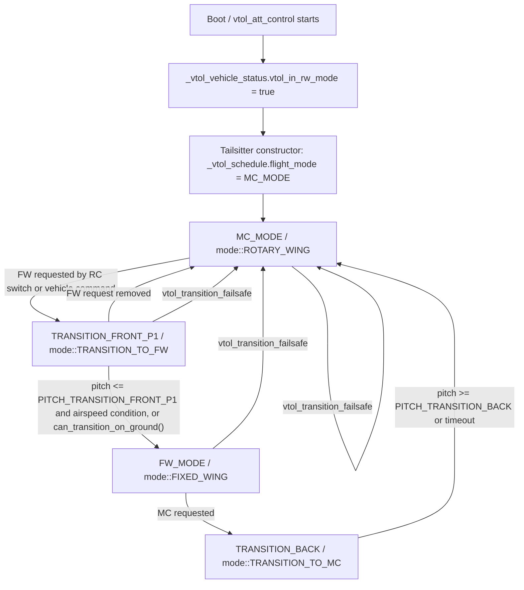

# TandemTailSitter Takeoff Mode Analysis

Date: 2026-07-12

## Scope

This document analyzes the current PX4-WR-ST VTOL initial mode and mode switching logic for the TandemTailSitter aircraft. It does not modify source code, parameters, mixer logic, or implement automatic takeoff.

Target aircraft concept:

- Tail-sitter distributed-power tandem wing UAV.
- Jump takeoff should not use the normal rotary-wing takeoff logic.
- After arming, the desired behavior is to use fixed-wing control logic for takeoff.
- A later waypoint-triggered fixed-wing to rotary-wing transition is planned, but not implemented here.

## Files Checked

```text
src/modules/vtol_att_control/vtol_att_control_main.cpp
src/modules/vtol_att_control/tailsitter.cpp
src/modules/vtol_att_control/vtol_type.cpp
src/modules/commander/Commander.cpp
src/modules/commander/Arming/PreFlightCheck/checks/rcCalibrationCheck.cpp
msg/vtol_vehicle_status.msg
msg/vehicle_status.msg
```

## Current State Machine Flow



Simplified published status:

| Internal Tailsitter mode | Published VTOL mode | `vtol_in_rw_mode` | `vtol_in_trans_mode` |
| --- | --- | --- | --- |
| `MC_MODE` | `mode::ROTARY_WING` | `true` | `false` |
| `TRANSITION_FRONT_P1` | `mode::TRANSITION_TO_FW` | `true` | `true` |
| `FW_MODE` | `mode::FIXED_WING` | `false` | `false` |
| `TRANSITION_BACK` | `mode::TRANSITION_TO_MC` | `true` during transition | `true` |

## Current Default Mode

Current default after startup is rotary-wing / multicopter mode.

Evidence:

1. `vtol_att_control_main.cpp` constructor initializes:

```cpp
_vtol_vehicle_status.vtol_in_rw_mode = true; /* start vtol in rotary wing mode */
```

2. `tailsitter.cpp` constructor initializes:

```cpp
_vtol_schedule.flight_mode = vtol_mode::MC_MODE;
_vtol_schedule.transition_start = 0;
```

Therefore, current default is:

```text
MC_MODE
```

It is not `FW_MODE` and not `TRANSITION`.

## Which Variable Decides Initial Flight Mode

The key initial internal state is:

```cpp
_vtol_schedule.flight_mode
```

For the tailsitter implementation, this variable is owned by the `Tailsitter` class and initialized in:

```text
src/modules/vtol_att_control/tailsitter.cpp
```

The published uORB status used by downstream modules is derived from this internal mode:

```cpp
_vtol_vehicle_status.vtol_in_rw_mode
_vtol_vehicle_status.vtol_in_trans_mode
```

Commander then uses `vtol_vehicle_status.vtol_in_rw_mode` to update `vehicle_status.vehicle_type`:

```text
vtol_in_rw_mode == true  -> VEHICLE_TYPE_ROTARY_WING
vtol_in_rw_mode == false -> VEHICLE_TYPE_FIXED_WING
```

## Why It Initializes To MC_MODE

This follows PX4's standard tailsitter assumption:

- A tailsitter normally starts vertically.
- The normal safe initial control state is multicopter / rotary-wing mode.
- Front transition from MC to FW is initiated only after a switch or command requests fixed-wing mode.
- Failsafe transition behavior also favors returning to MC mode.

The comment in `tailsitter.cpp` describes a switch-driven transition:

```text
after flipping the switch the vehicle will start tilting in MC control mode,
picking up forward speed. After the vehicle has picked up enough and sufficient
pitch angle the uav will go into FW mode.
```

This is different from the current TandemTailSitter design requirement, where jump takeoff is intended to use fixed-wing control logic immediately.

## Is There A Parameter For Default Startup Mode

No clear existing parameter was found that changes the initial `Tailsitter::_vtol_schedule.flight_mode` from `MC_MODE` to `FW_MODE`.

Relevant parameters exist for VTOL type, transition timing, airspeed transition threshold, elevon lock, fixed-wing permanent stabilization, differential thrust, and motor shutoff behavior. They do not appear to select the initial tailsitter flight mode.

Examples of related but insufficient parameters:

- `VT_TYPE`: selects VTOL architecture/type, not initial mode.
- `VT_ELEV_MC_LOCK`: controls elevon locking in MC, not initial mode.
- `VT_ARSP_TRANS`: transition airspeed threshold, not initial mode.
- `VT_TRANS_MIN_TM`, `VT_F_TRANS_DUR`: transition timing, not initial mode.
- `VT_FW_PERM_STAB`: affects stabilization behavior, not initial mode.

## QGC / RC / MAVLink Switching Before Arming

### QGC

QGC can normally trigger VTOL transition by sending:

```text
VEHICLE_CMD_DO_VTOL_TRANSITION
```

In this codebase, `vtol_att_control_main.cpp` listens for that command and stores:

```cpp
_transition_command = int(vehicle_command.param1 + 0.5f);
```

The command requests either:

```text
vtol_vehicle_status_s::VEHICLE_VTOL_STATE_FW
vtol_vehicle_status_s::VEHICLE_VTOL_STATE_MC
```

However, QGC can only be relied on if the vehicle is recognized as VTOL and the UI exposes a VTOL transition action. If the current vehicle type remains rotary-wing at startup, QGC may show a VTOL transition button only after the system reports VTOL capability and receives status updates.

### RC Switch

RC switch support is present through:

```text
RC_MAP_TRANS_SW
```

`VtolAttitudeControl::is_fixed_wing_requested()` uses:

```cpp
_manual_control_switches.transition_switch == manual_control_switches_s::SWITCH_POS_ON
```

when manual control is enabled and the transition switch is mapped.

`rcCalibrationCheck.cpp` also checks `RC_MAP_TRANS_SW` for VTOL vehicles.

### MAVLink Command

External MAVLink command support exists through:

```text
MAV_CMD_DO_VTOL_TRANSITION
```

In PX4 source this maps to:

```text
vehicle_command_s::VEHICLE_CMD_DO_VTOL_TRANSITION
```

For an unarmed or landed vehicle, tailsitter transition completion can be immediate because `can_transition_on_ground()` returns true:

```cpp
return !_v_control_mode->flag_armed || _land_detected->landed;
```

Therefore, in principle:

- Before arming, QGC/RC/MAVLink can request FW.
- Tailsitter can enter `TRANSITION_FRONT_P1`.
- Since unarmed satisfies `can_transition_on_ground()`, it can then settle into `FW_MODE`.

Practical caveat:

- The system must actually be running `vtol_att_control`.
- The aircraft must be recognized as VTOL/tailsitter.
- Manual mode switch logic can override `_transition_command` while manual control is enabled.
- If RC transition switch is mapped and manual control is enabled, the RC switch position takes priority over MAVLink command.

## Minimum Changes For ARM Directly Into FW_MODE

If the desired behavior is "after arming, directly use fixed-wing logic", the smallest conceptual change is in the VTOL state machine, not in the mixer.

Potential minimal locations:

1. `src/modules/vtol_att_control/tailsitter.cpp`

Change or gate the constructor initial mode:

```cpp
_vtol_schedule.flight_mode = vtol_mode::MC_MODE;
```

to a TandemTailSitter-specific initial `FW_MODE`, or initialize from a new parameter.

2. `src/modules/vtol_att_control/vtol_att_control_main.cpp`

Ensure the published status matches the desired initial mode:

```cpp
_vtol_vehicle_status.vtol_in_rw_mode = false;
_vtol_vehicle_status.vtol_in_trans_mode = false;
```

This should be done carefully so generic VTOL behavior is not changed for other aircraft.

3. Commander status propagation

Commander already updates:

```text
vehicle_type = FIXED_WING when vtol_in_rw_mode == false
```

So if `vtol_att_control` publishes FW state early enough, commander can track it.

4. Parameter-gated approach

A safer minimal code change would be a Tandem-specific or parameter-gated default mode:

```text
VT_TAND_START_FW = 0/1
```

or a more general:

```text
VT_INIT_MODE = MC/FW
```

The implementation should only apply to the TandemTailSitter / custom airframe, not standard tailsitters.

## Risk If Default Mode Is Directly Changed To FW_MODE

Directly replacing the constructor default with `FW_MODE` is simple, but it has nontrivial side effects.

### Transition Logic

Starting in `FW_MODE` bypasses the normal MC-to-FW front transition path:

```text
MC_MODE -> TRANSITION_FRONT_P1 -> FW_MODE
```

This may skip initialization normally done when entering transition:

- `transition_start`
- `_flag_was_in_trans_mode`
- transition attitude setpoint setup
- MC/FW weighting ramps

For the desired jump takeoff concept this may be acceptable, but it should be explicit and isolated to this aircraft.

### `actuator_controls_0`

In tailsitter `fill_actuator_outputs()`:

```cpp
if (_vtol_schedule.flight_mode == vtol_mode::FW_MODE) {
    mc_out[THROTTLE] = fw_in[THROTTLE];
    mc_out[PITCH] = fw_in[PITCH] * diff_thrust_scale;
    if (diff_thrust == 1) {
        ...
    }
}
```

This means that even in FW mode, group 0 may be populated from fixed-wing inputs for throttle and pitch-related differential thrust. That can be useful for this design because `pwm_mix_out` fixed-wing logic reads `thr0`, `pitch0`, and `yaw0`.

Risk: if `fw_att_control` is not active or not generating expected fixed-wing controls at arming, group 0 may be zero, stale, or not aligned with intended takeoff behavior.

### MC Controller State

When `vtol_in_rw_mode == false`, downstream logic will treat the vehicle as fixed-wing. MC position control flags and rotary-wing assumptions in commander are reduced or disabled. This is desirable for fixed-wing takeoff, but it means normal multicopter stabilization is not available at arming.

Risk: if the aircraft is physically vertical or constrained on a support, fixed-wing attitude controller assumptions may not match the body attitude and may command large surfaces or thrust differential.

### Failsafe

`check_quadchute_condition()` is called in `update_fw_state()` and transition state. Quadchute logic may force a failsafe back to MC in some cases.

Also, if `_vtol_vehicle_status.vtol_transition_failsafe` is set, `tailsitter.cpp` forces:

```cpp
_vtol_schedule.flight_mode = vtol_mode::MC_MODE;
```

Risk: a default-FW takeoff mode may immediately bounce back to MC if failsafe conditions are triggered by low altitude, attitude, or landing status.

### Land Detector

Ground transition allowance depends on:

```cpp
!flag_armed || landed
```

Changing default to FW while landed affects how commander labels the vehicle type and how arming/soft-stop behavior is handled.

Commander sets:

```cpp
_armed.soft_stop = (_status.vehicle_type != VEHICLE_TYPE_ROTARY_WING)
```

Risk: fixed-wing mode while landed may change actuator soft-stop behavior compared with rotary-wing startup assumptions.

## Recommended Schemes

### Scheme A: Preserve PX4 Structure, Use Existing Mode Switching

Use existing transition mechanisms:

- QGC VTOL transition command.
- RC transition switch via `RC_MAP_TRANS_SW`.
- MAVLink `MAV_CMD_DO_VTOL_TRANSITION`.

Procedure for ground HITL testing:

1. Boot in default MC.
2. Before arming, request FW using RC switch/QGC/MAVLink.
3. Confirm:

```text
vtol_vehicle_status.vtol_in_rw_mode == false
vtol_vehicle_status.vtol_in_trans_mode == false
vehicle_status.vehicle_type == FIXED_WING
```

4. Arm only after FW mode is confirmed.

Pros:

- No source-code change.
- Uses existing PX4 VTOL command path.
- Lowest risk to commander/failsafe/land detector.

Cons:

- Operationally fragile if QGC does not expose the transition button or RC switch is not configured.
- Easy to accidentally arm in MC mode.
- Does not encode the aircraft's special takeoff concept in firmware.

Recommendation:

- Best short-term validation path.
- Add ground-test checklist and log checks.

### Scheme B: Modify VTOL State Machine For TandemTailSitter Default FW Takeoff

Add a Tandem-specific startup mode path in `tailsitter.cpp` and possibly `vtol_att_control_main.cpp`.

Preferred shape:

- Add a parameter or airframe-specific flag.
- Only apply to this TandemTailSitter configuration.
- Initialize `_vtol_schedule.flight_mode = FW_MODE`.
- Publish `vtol_in_rw_mode = false`, `vtol_in_trans_mode = false`.
- Keep existing transition paths for later FW-to-MC and MC-to-FW.

Pros:

- Matches design requirement: arming enters fixed-wing control logic.
- Avoids relying on QGC/RC pre-arm switching.
- Keeps changes localized to VTOL state machine instead of mixer.

Cons:

- Must audit commander arming behavior, soft-stop, failsafe, and control mode flags.
- Must ensure fixed-wing controllers publish valid actuator controls before and after arming.
- Requires careful Tandem-only gating to avoid breaking standard tailsitters.

Recommendation:

- Best medium-term firmware solution if jump takeoff is fundamental to this airframe.
- Do not simply change all tailsitters from `MC_MODE` to `FW_MODE`.

### Scheme C: Add A New Takeoff State Machine Without Affecting Standard VTOL

Introduce a dedicated Tandem jump-takeoff state machine, separate from standard tailsitter MC/FW initialization.

Concept:

```text
TANDEM_JUMP_TAKEOFF_FW
-> FW climb / accelerate
-> waypoint or mission trigger
-> FW-to-MC transition
```

Pros:

- Cleanly represents the aircraft's nonstandard takeoff concept.
- Avoids overloading standard tailsitter transition semantics.
- Easier to add later waypoint-triggered transition logic.
- Can own arming checks and takeoff-specific safety conditions.

Cons:

- Larger implementation.
- More test burden.
- Requires integration with commander/navigation/mission logic.

Recommendation:

- Best long-term architecture if this aircraft will need automated jump takeoff and waypoint-triggered transitions.
- Not recommended for the immediate mixer/ground validation phase.

## Practical Recommendation

For the next test step:

1. Do not modify the mixer further.
2. Try Scheme A first:
   - Configure `RC_MAP_TRANS_SW`, or use QGC/MAVLink VTOL transition before arming.
   - Confirm `vtol_in_rw_mode == false` before arming.
   - Confirm `pwm_mix_out` log shows `mode=FW`.
3. If manual pre-arm switching is unreliable, implement Scheme B with a Tandem-specific parameter-gated default FW startup.
4. Defer Scheme C until automatic jump takeoff and waypoint-triggered transition are actually being designed.

## Open Questions

- Does QGC currently expose the VTOL transition control for this airframe in HITL?
- Is `RC_MAP_TRANS_SW` configured in the HITL parameter set?
- Does `vtol_att_control` run and publish `vtol_vehicle_status` before arming in the HITL setup?
- Does `fw_att_control` produce stable `actuator_controls_0/1` while the vehicle is stationary and supported vertically?
- Does commander allow arming when `vehicle_type` has already changed to fixed-wing for a VTOL tailsitter?
